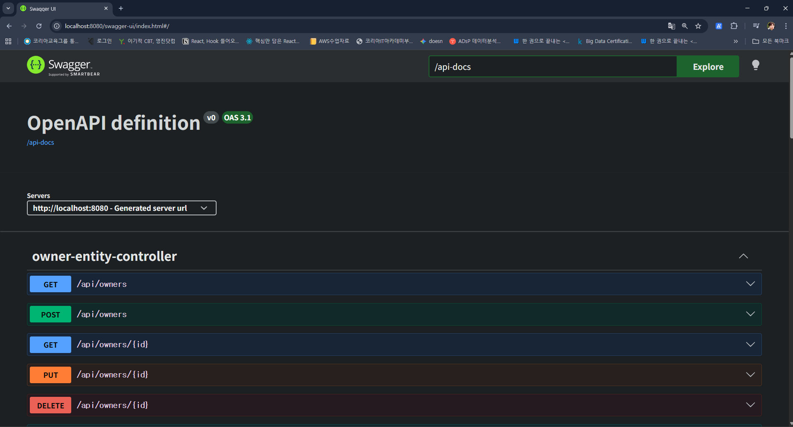

# 입실 체크 해주세요 !! 🎈

# RESTful API 명세서 작성
- RESTful API는 이용하는 개발자가 그 기능과 작동을 이해할 수 있도록 적절히 문서화가 되어야 합니다(어제 notion 예시 보여드렸습니다). 그리고 그 문서에는 이용할 수 있는 엔드포인트, 허용되는 데이터 형식, API와 상호작용하는 방법 등이 포함되어야 한다.

- 현재 저희는 Spring Data REST를 적용한 상태입니다. 즉 엔드포인트들이 자동생성되기 때문에 우리가 파악하지 못한 부분들이 있을 수 있어 API 명세서는 더 중요하다고 할 수 있습니다.

# SpringBoot의 Swagger / Open API
1. Swagger / Open API 란?
  - OpenAPI Specification(OAS) : RESTful API를 설계, 구축, 문서화하는 방법을 정의하는 표준 사양.
  - Swagger : 이상의 표준 사양을 구현하여 개발자가 API 구조를 시각적으로 확인하고 직접 테스트할 수 있도록 돕는 툴.
  - 도입 목적 : 백-프론트 간 협업 시 별도의 문서 작성 없이 실시간으로 업데이트되는 API 명세서를 제공하기 위함.
# API 란 ?
## 정의
- Application Programming Interface의 축약어로 _서로 다른 소프트웨어가 대화할 수 있게 해주는 규칙이나 매개체_
- 손님(Client) : 주문을 하는 사람(앱이나 웹사이트)
- 주방(Server) : 요리를 하는 곳(데이터나 기능을 가진 시스템)
- 점원(API) : 손님이 주문을 주방에 전달하고, 주방에서 만든 음식을 다시 손님에게 가져다 주는 역할

- 이상에서의 중요한 점은 손님은 주방 안에서 어떤 일이 일어나는지(내부 로직) 알 필요가 없다는 점입니다. 점원에게 정해진 규칙(메뉴)대로 말하기만 하면 원하는 결과를 얻을 수 있다는 점이 핵심.

## API의 핵심 역할
1. 전달자 : 요청(request)을 받고 응답(response) - req / resp 로 작성하는 경우도 있음.
2. 보안/관문 : 아무나 데이터를 가져가지 못하게 인증된 사용자만 접근을 허용함(API Key를 활용합니다-챗봇 만들 때 써봤습니다).
3. 표준화 : 서로 다른 언어(Java / Python 등)로 만들어진 프로그램들이 같은 규칙으로 소통하게끔 한다.

- 우리가 만든 백엔드의 Controller 클래스가 API의 입구가 됩니다. 즉, Controller 클래스는 프론트엔드에서 요청이 왔을 때 맨 처음 백엔드 상으로 처리하는 관문 역할을 하는 곳이라고 볼 수 있습니다.

# 프로젝트 설정
1. SpringBoot 3.xx 버전에서는 `jakarta`로 써야 합니다. 혹시 옛날 버전 들고 오면 `javax`로 작성하는 경우가 있습니다.
```java
	implementation 'org.springdoc:springdoc-openapi-starter-webmvc-ui:2.8.15'
```
- starter가 포함된 버전을 사용해야 오류가 나지 않습니다.
- mvn을 통할 경우 openapi를 검색하면 너무 뭐가 많이 나오는데 starter/webmvc 존재 유무로 체크하시면 됩니다.

2. application.properties 수정
- Swagger UI의 경로와 API 문서의 기본 정보를 설정합니다. 현재 저희는 Spring Data REST 때문에 basePath가 `/api`로 되어있다는 점을 꼭 고려하셔야 합니다.

```java
# Swagger UI access path config(default : /swagger-ui/index.html)
springdoc.swagger-ui.path=/swagger-ui.html

# open api doc path
springdoc.api-docs.path=/api-docs

# Integrated Configuration related to the Spring Data REST
springdoc.show-data-rest=true
```

예를 들어 이상까지만 작성했더라도 http://localhost:8080/swagger-ui/index.html 로 접속했을 경우에

이렇게 뜹니다.

3. API 문서 상세 설정