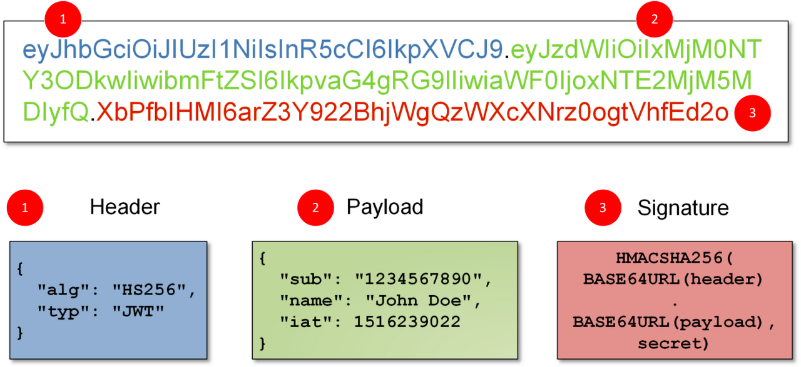

# 입실 체크 해주세요 !! 🎈

## 금일 수업 계획
1. JWT

## JWT로 백엔드 보호하기
- 어제까지의 수업에서 RESTful 웹 서비스에서의 기본 인증(postman 상에서 basic auth)을 이용하는 방법을 학습했습니다. 기본 인증이란 토큰을 처리하거나 세션을 관리하는 방법이 포함되지 않습니다. 해당 방식은 사용자가 로그인할 때 각 요청과 함께 자격 증명이 함께 전송되므로 보안 상의 문제가 있을 수 있습니다. 그리고 해당 방식은 리액트로 자체 프론트엔드를 개발할 때 이용하는 것이 불가능합니다. 대신 JWT를 이용한 인증 방법을 사용할 예정입니다.

### JWT 란 ?
- 인증 구현 방법 중 하나, 인증 및 권한 부여(Authentication & Authorization) 목적으로 RESTful API에서 가장 보편적으로 사용됩니다.
- 인증(Authentication) : 보통 로그인 과정과 관련
- 인가/권한부여(Authorization) : 특정 역할이 특정 페이지를 들어갈 수 있는지 없는지에 여부
    - 즉, 인증은 받았기 때문에 로그인이 가능하긴 하지만, 회원이 다른 회원을 삭제할 권한은 없는 반면에, 관리자는 다른 회원을 조회하거나 삭제하는 권한을 가질 수도 있음. 즉, 인증 이후의 특정 HTTP 요청에 관한 권한에 가깝습니다.
- JWT 자체는 크기가 매우 작기 때문에 URL / POST 매개변수 또는 헤더 내부에 담아서 전송하는 것이 가능합니다. 본시 수업 중에는 postman 상에서의 요청을 할 때 예시를 제공 예정.
- JWT 내부에는 사용자 이름과 역할 등 필수적인 정보를 담는 것이 가능
### JWT의 구조

- header : 토큰의 유형과 해싱 알고리즘을 정의
- payload : 인증에서 일반적으로 사용자 정보를 포함.
- signiture : 토큰이 도중에 변경되지 않았는지 확인하는 데 이용
